# Design-system reference renders

These PNGs are checked-in compose-preview output, captured against the
production composables (`HomeContent`, `FileSyncContent`, `ManageSyncContent`)
under both themes for side-by-side review. Regenerated via:

```sh
ANDROID_HOME=$ANDROID_SDK_ROOT compose-preview show --json --filter "Cadence|System|Manage"
```

then copied from `composeApp/build/compose-previews/renders/` here.

Companion document: [../STYLE_GUIDE.md](../STYLE_GUIDE.md).

## Curate (default home)

| | System (Roboto Flex + dynamic) | Cadence (Manrope/Inter + Coastal Blue) | Cadence dark |
| --- | --- | --- | --- |
| Curate home | 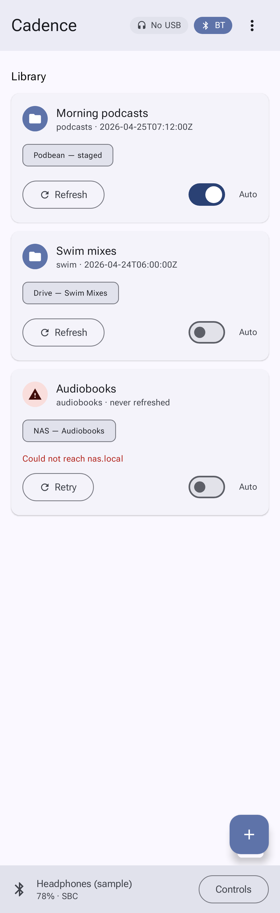 | 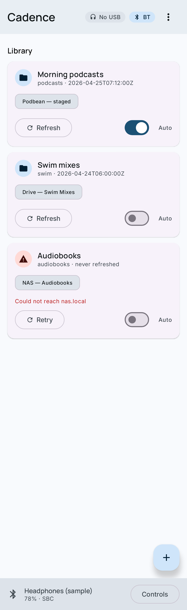 | 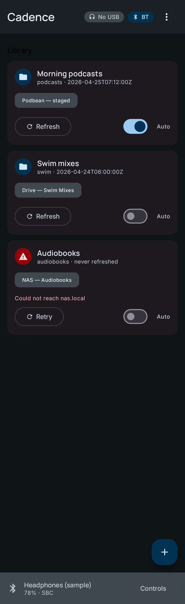 |
| Curate + USB banner | 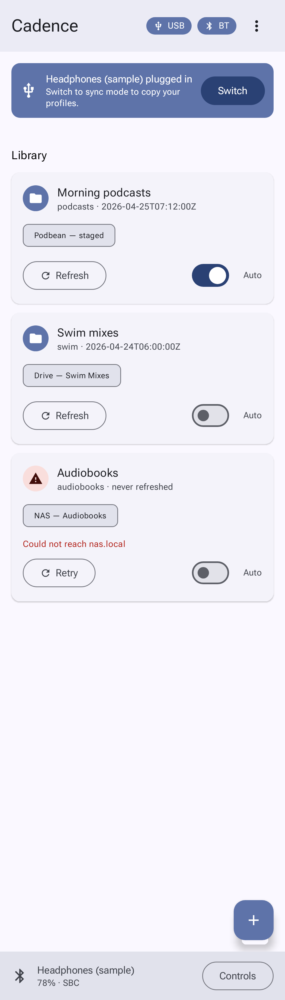 | 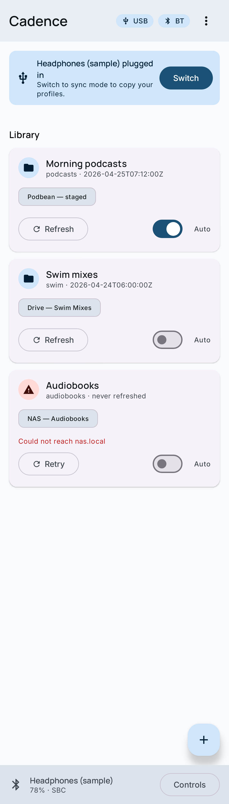 | — |

## Sync (USB-attached)

| | System | Cadence | Cadence dark |
| --- | --- | --- | --- |
| Sync ready | 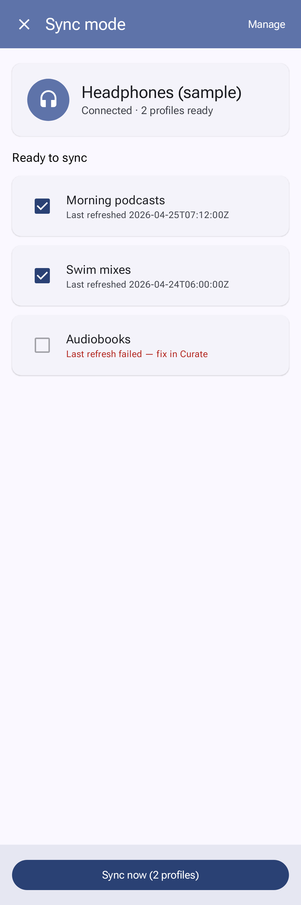 | 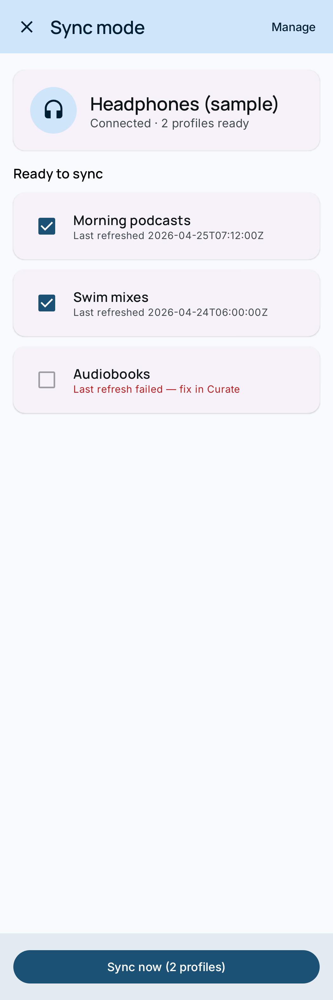 | 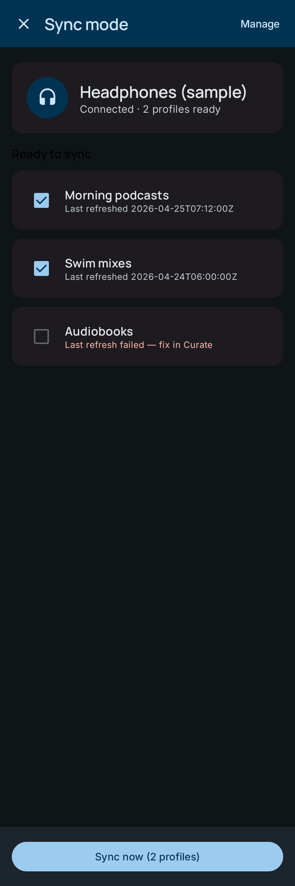 |
| Syncing | 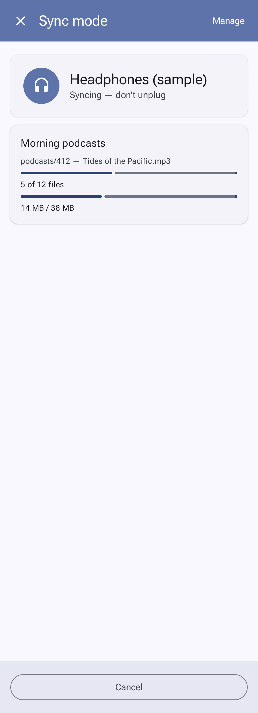 | 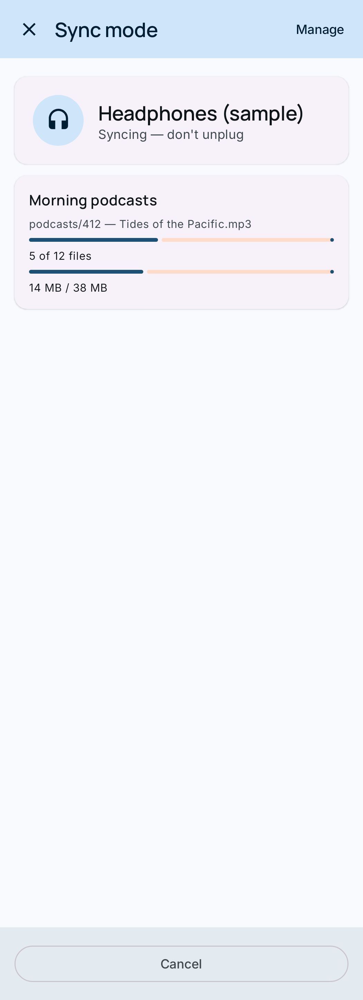 | — |
| Complete | 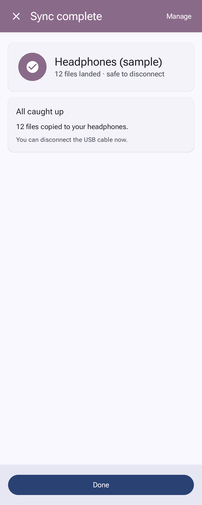 | 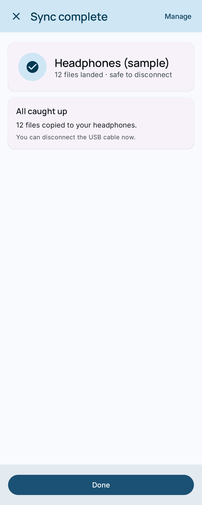 | — |

## Manage (deep config + Appearance toggle)

The `Manage` screen now hosts the Appearance toggle (`System` / `Cadence`) at
the top of the page.

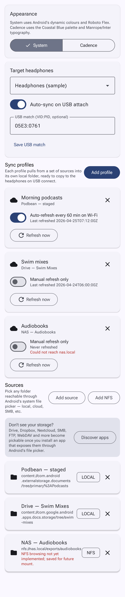
